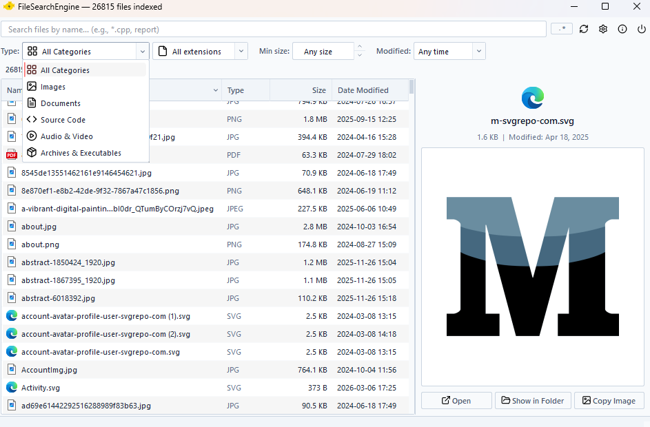
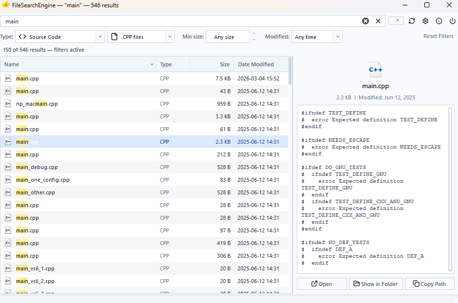
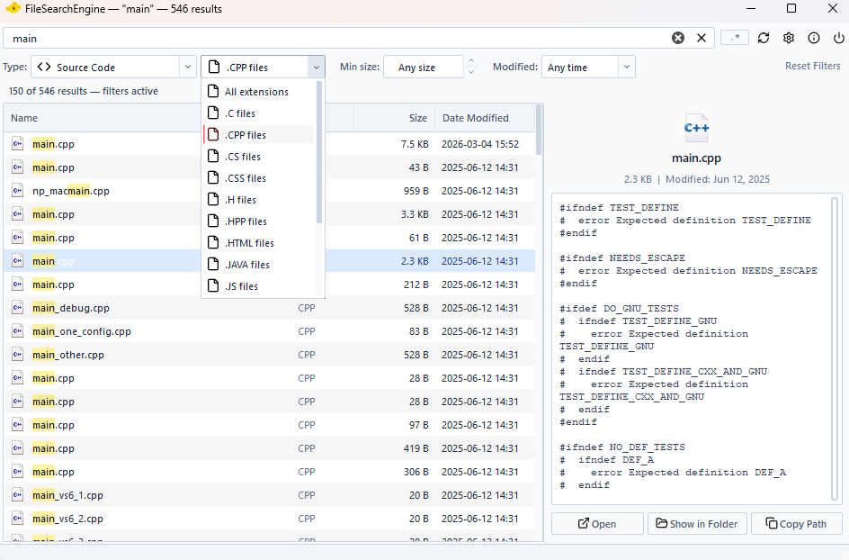
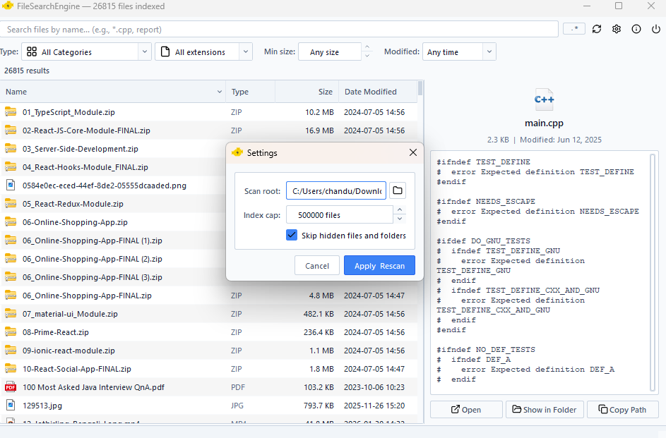

# ⚡ FileSearchEngine

A blazing-fast, strictly minimalist file search utility for Windows. Built for power users, it features a native global summon hotkey, a multi-threaded architecture, and a "Ghost Engine" that silently synchronizes with the Windows OS in the background.

---

## ✨ Core Features

* **Global OS Summon (`Ctrl + Space`)** Hooks directly into the native Windows API (`windows.h`). Summon or dismiss the application instantly from anywhere, even while working full-screen in other apps.
* **The "Ghost Engine" (Real-Time Sync)** Utilizes `QFileSystemWatcher` to monitor the file system continuously. OS-level file additions, deletions, or modifications are silently hot-swapped into the search index without freezing the UI or requiring a manual rebuild.
* **Aggressive Multi-Threading** Complete separation of concerns. File indexing (`BFS` traversal) and query execution operate on dedicated `QThread` workers, guaranteeing a butter-smooth UI even when parsing millions of files.
* **Classic Minimalist UI** Designed for maximum information density. Features sharp geometry, strict typography, and a tightly packed table view to maximize vertical screen space.
* **Deep Preview Panel** Instantly previews images (`.png`, `.jpg`, `.svg`, etc.) and syntax-highlights over 40+ developer text formats (`.cpp`, `.json`, `.py`, `.md`) directly within the app.
* **Rich Hover Tooltips** Hovering over deeply packed rows reveals a dynamic HTML-styled card displaying full absolute paths, file sizes, and precise timestamps.

---

## 📸 App Showcase

### Real-Time Ghost Engine & Cascading Filters

### Deep Text & Source Code Preview

### Native Image & Media Preview

---

## 🛠️ Architecture & Tech Stack

* **Language:** C++17
* **Framework:** Qt 6.7.3 (Widgets module)
* **Compiler:** LLVM MinGW 64-bit
* **Key Qt Classes Used:** `QThread`, `QFileSystemWatcher`, `QStackedWidget`, `QAbstractTableModel`, `QItemDelegate`

---

## 🚀 Getting Started

### Prerequisites
* **Qt 6.7.3** or higher (installed via the Qt Maintenance Tool).
* **MinGW 64-bit** compiler.

### Building from Source
1. Clone the repository:
   git clone [https://github.com/sekhar-dev79/FileSearchEngine.git](https://github.com/sekhar-dev79/FileSearchEngine.git)
   Open FileSearchEngine.pro in Qt Creator.
2. Configure the project for your MinGW 64-bit kit.
3. Set the build configuration to Release.
4. Click Build and Run.

Deployment (Standalone Setup)
To create a standalone application folder without relying on Qt Creator:
1. Open the Qt 6.7.3 MinGW Command Prompt.
2. Navigate to your compiled Release folder.
3. Run the deployment tool to fetch all necessary runtime DLLs:

windeployqt --compiler-runtime FileSearchEngine.exe
(Note: For an even cleaner build, you can safely delete the opengl32sw.dll, Qt6Pdf.dll, and translations folder from the deployment output, as they are not required for this specific widget architecture).

📄 License: 
This project is licensed under the MIT License - see the LICENSE file for details.
   
